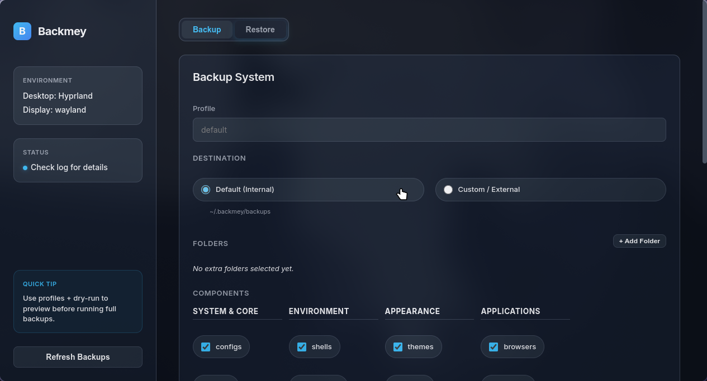

<div align="center">

# Backmey
**The Ultimate Linux Desktop Backup & Restore Tool**


**Backup what matters, restore anywhere.**
Configs, themes, fonts, browsers, and packages. Cross-distro.


</div>

---

## 🚀 Why Backmey?

Backmey isn't just a file copier. It **understands** your Linux desktop.

*   **🎨 Component-Based**: Select exactly what you want—themes, icons, wallpapers, or terminal configs.
*   **🧠 Smart Restore**: Moved from Ubuntu to Arch? No problem. Backmey intelligently translates package names (e.g., `firefox` → `firefox-esr`) to install your apps on the new distro.
*   **💻 Desktop Agnostic**: Whether you use GNOME, KDE Plasma, Hyprland, or i3, Backmey detects and backs up your environment.
*   **📦 Modern App Support**: seamless handling of **Flatpak** and **Snap** applications.
*   **🔒 Secure**: Optional GPG encryption to keep your data safe.

---

## 💿 Installation (Desktop App)

The easiest way to use Backmey is the Desktop App (AppImage).

### 1. Build or Download
If you have the source:
```bash
# Build the AppImage
cd electron
npm install
npm run dist
```
*The AppImage will be in `electron/dist/`.*

### 2. Install to Menu
We provide a handy script to install the app, icon, and menu entry automatically:
```bash
bash install_app.sh
```
Search for **"Backmey"** in your application launcher!

---

## 🛠️ Usage

### 1. Backup
Launch the app, select your profile (e.g., "Work Laptop"), and choose your components.
*   **System & Core**: Shells (`.bashrc`, `.zshrc`), standard configs (`.config`).
*   **Appearance**: Themes, cursors, icons, wallpapers.
*   **Applications**: Browsers (Firefox, Chrome), Flatpaks, Snaps.

### 2. Restore
*   Select a backup from the timeline.
*   Click **Restore**.
*   Backmey will carefully copy files, restore permissions, and attempt to install missing packages using your system's package manager (`apt`, `pacman`, `dnf`, etc.).

---

## ⚡ Advanced: CLI Usage

For power users, server environments, or automation, the core Python script is standalone.

**Backup:**
```bash
# Default backup to ~/.backmey/backups
python3 backmey.py backup --profile auto

# Encrypt with GPG
export BACKMEY_PASSPHRASE="m4gicpassword"
python3 backmey.py backup --profile secret --encrypt
```

**Restore:**
```bash
# Interactive restore
python3 backmey.py restore --archive ~/.backmey/backups/latest.tar.gz

# Restore package installation (Smart Resolve)
python3 backmey.py restore --archive backup.tar.gz --install-packages --yes
```

---

## 📁 Technical Details

- **Backups Location**: `~/.backmey/backups`
- **Portability**: Archives store relative `home/` paths, so you can restore to any user account.
- **Smart Resolver**: If a package is missing during restore, Backmey searches your distro's repository for similar names (fuzzy match) and auto-corrects.

---
<div align="center">
Made with ❤️ for the Linux Community
</div>
